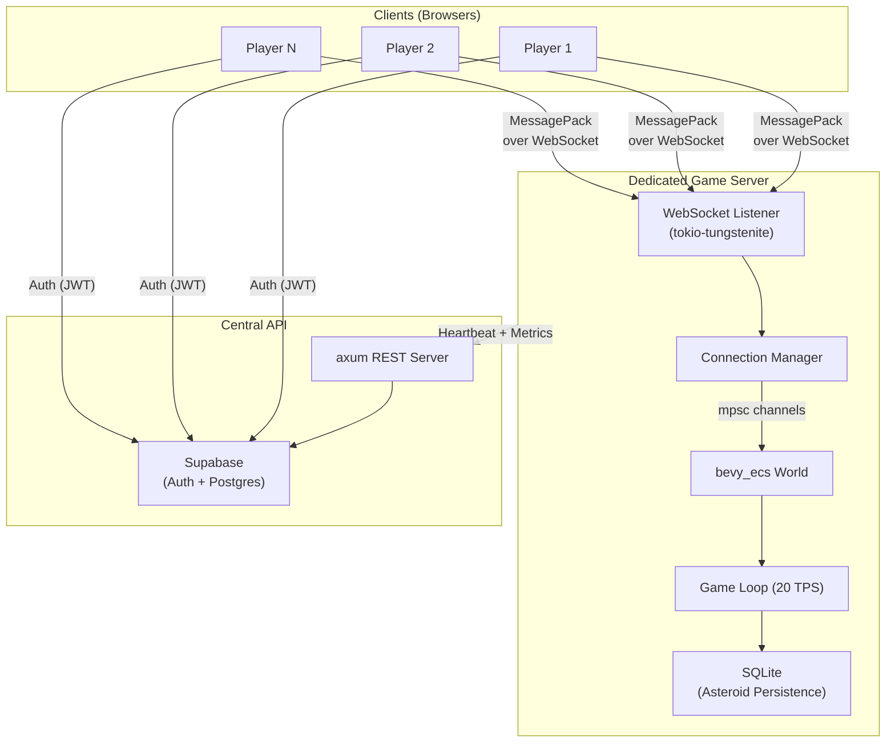
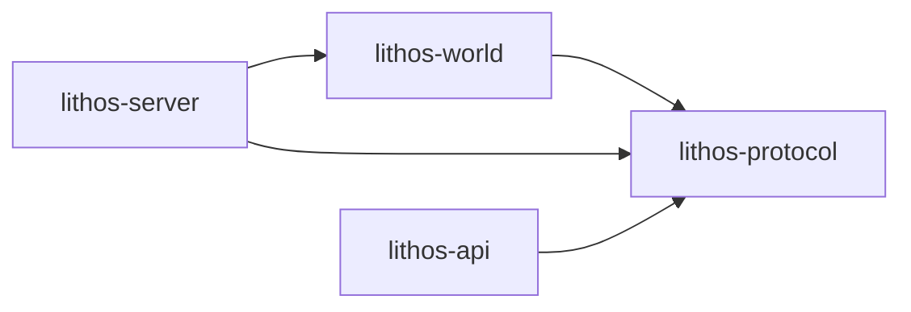

# Lithos — System Architecture

## Overview

Lithos uses a three-tier architecture: browser-based game clients connect to
Dedicated Game Servers (DGS) over WebSockets, while a Central API handles
authentication, faction management, and cross-server coordination.

## Crate Dependency Graph

## Data Flow

### Player Join

1. Client authenticates with Supabase → receives JWT.
2. Client opens WebSocket to DGS, sends `ClientMessage::Join { token }`.
3. DGS validates JWT, spawns player entity in bevy_ecs World.
4. DGS responds with `ServerMessage::JoinAck { player_id, entity_id, zone }`.

### Game Loop Tick

1. Drain inbound `mpsc` channel for client inputs.
2. Apply movement, physics, and collision systems.
3. Build `StateSnapshot` for each connected client (interest management).
4. Broadcast snapshots over WebSocket.

### Zone Transfer

1. Client sends `ClientMessage::ZoneTransfer { target }`.
2. Server removes entity from current zone, inserts into target zone.
3. Server sends `ServerMessage::ZoneChanged { zone }`.
4. Client transitions Phaser scene.
